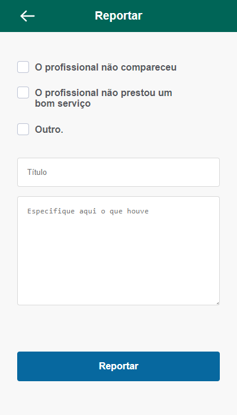

## Esther Report

pt-br

### Tela de reportar do Aplicativo Esther Home Care para o desafio técnico da UpBase

## Introdução

Desafio técnico para Upbase feito em ReactJs com a metodologia mobile first garantindo uma ótima experiencia de usuário utilizando de boas práticas do desenvolvimento web, a proposta foi fazer uma tela mobile seguindo um layout disponibilizado no figma e pode ser acessado pelo [link](https://clebersevero-reportar1.vercel.app/)

O projeto foi feito com React, Sass, contando com as melhores práticas buscando performace, bons visuais e layout totalmente responsivo. As principais ferramentas utilizadas são: React Js, Sass, useState, Componentes do Material UI(Tooltip) e Figma.

### Principais funcionalidades:

- Formulário da tela de reportar
- Componente com checkboxes personalizadas
- Validação do formulário
- Tooltip no topo da aplicação com mensagem de sucesso

### Obrigado por visitar o Projeto!

---

en

### Esther Home Care Report screen to UpBase's technical challenge

## Introduction

Technical challenge done for UpBase built with ReactJs with mobile first method garanting a great user experience conting on web development good practices. The proposed challenge was to build a mobile screen following as close as possible a Fima layout and it can be accessed on the [link](https://clebersevero-reportar1.vercel.app/).

The project has been made with React, Sass, having the best practices looking for perfomrmace, good styling and responsive design. The main tools used are: React Js, Sass, useState, Material UI components(Tooltip) and Figma.

### Main features:

- Report screen from
- Custom checkboxes component 
- Form validation
- Success message tooltip on top

### Thank you for having a look on this project!

### Desktop version

## Installation:

    To install the app locally, clone the app and make sure you have node Installed.
    Follow the instructions bellow to run de dependences:

    - set jsxconfig.json "baseUrl": "src"
    - npm install
    - npm install react-router-dom
    - npm install react-icons --save
    - npm install @mui/material @emotion/react @emotion/styled
    - npm install swiper
    - npm run dev

## Techs:

 

  
  
   
   
 

 

### Developer: Cléber Severo

 
 

 
